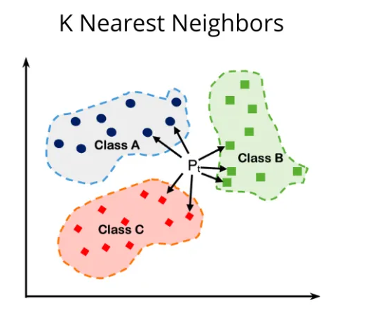

# k-nearest neighbors (KNN):

The k-nearest neighbors (KNN) algorithm is a non-parametric, supervised learning classifier that uses proximity to make classifications or predictions about the grouping of an individual data point. It is one of the most popular and simplest classification and regression algorithms used in machine learning today.

## Proximity and Closeness
The KNN algorithm relies on the concept of proximity or closeness to classify data points. For instance, if you have a dataset of **fruits** with features such as **weight** and **sweetness**, and you want to classify a **new fruit**, KNN will measure the **distance** between this new fruit and all other fruits in the dataset. For K = 3, if the **among the closest three fruits** are **two apples** and **one orange**, the algorithm will classify the **new fruit** as **an apple** due to its **proximity** to those closest examples.

## Non-Parametric Nature
KNN is considered non-parametric because it makes no assumptions about the underlying data distribution (**data distributions**: Remember in statistics, we used frequency distribution table) . For example, in a dataset of animal species based on features like weight, height, and color, KNN can classify a new animal without assuming a specific distribution (like normal distribution or frequency distribution) of the data. 
 
Instead, it directly uses the data points to make decisions based on their relationships.

## Classification Problems
KNN is **mainly** used for **classification** problems. For example, in a handwritten digit recognition task, each digit (0-9) can be represented as an image. When a new digit image is inputted, KNN looks at the k nearest digit images in the training set. If, for instance, (k = 5) the closest **five images** consist of three '7's and two '9's, the algorithm assigns the label '7' to the new image based on majority voting.

## Usage in Regression Problems
KNN can also be used for regression tasks. For instance, imagine predicting the price of houses based on features like size and location. When a new house data point is introduced, KNN will find the k nearest houses and calculate the average price of those houses. If the nearest three houses sold for $300,000, $350,000, and $400,000, the algorithm would predict the new house's price as approximately $350,000, which is the average of the neighbors' prices.

## Lazy Learning : (Very Important)  
KNN is classified as a lazy learning algorithm because it doesn't have a **training phase**; it simply stores the **entire training dataset**. For example, imagine KNN as a data analyst who keeps all customer information in a database instead of summarizing it into a model. When a new customer inquiry comes in, the analyst queries the database to find similar customers based on their characteristics. 
 
This method allows for flexible responses, but it can be **slow** because the analyst has to search through **all the records** **each time a new inquiry** is made.

## An Example : 

Let's consider an example of data points where the attributes are two-dimensional, representing fruits. The coordinates (x, y) refer to size and sweetness, respectively. Based on these data points, fruits are classified as Apple (A), Banana (B), and Coconut (C). 

Now, let's set **K = 7** for our K-Nearest Neighbors (KNN) algorithm. We have a new fruit represented by a point, **Pt**. To classify this new fruit, we will analyze its 7 closest neighbors in the dataset.

After identifying the neighbors, suppose we find:
- 3 are Bananas (B)
- 2 are Apples (A)
- 2 are Coconuts (C)

Based on majority voting, the new fruit **Pt** should be classified as a **Banana (B)** since it has the highest count among the neighbors.

Here, before determining what the new fruit is, the algorithm evaluates its 7 nearest neighbors. There is no model or mathematical expression built using the dataset before. The dataset points are simply stored, and when classifying a new data point, the algorithm goes through the stored data to find its 7 (or K) closest points.

 

## A Tabular Example :

### **Step 1: mall Dataset**
We have a dataset where we classify a person as **Fit (1)** or **Unfit (0)** based on their **Weight (kg)** and **Height (cm)**.

| Person | Weight (kg) | Height (cm) | Class (Fit=1, Unfit=0) |
|--------|------------|------------|----------------|
| A      | 55         | 160        | 1 (Fit)       |
| B      | 70         | 170        | 0 (Unfit)     |
| C      | 60         | 165        | 1 (Fit)       |
| D      | 90         | 175        | 0 (Unfit)     |
| E      | 80         | 180        | 0 (Unfit)     |

Now, we have a **new person (X) with Weight = 65 kg and Height = 168 cm**, and we want to classify whether they are **Fit (1) or Unfit (0)** using **KNN with K = 3**.

### **Step 2: Calculate Distance (Euclidean)**
The Euclidean distance formula between two points (x1, y1) and (x2, y2) is:  
Distance = sqrt((x2 - x1)² + (y2 - y1)²)

Let's calculate the distance of Person X (65, 168) from all other points.

1. Distance from **A (55, 160)**  
   = sqrt((65 - 55)² + (168 - 160)²)  
   = sqrt(10² + 8²)  
   = sqrt(100 + 64)  
   = **12.81**
   
2. Distance from **B (70, 170)**  
   = sqrt((65 - 70)² + (168 - 170)²)  
   = sqrt((-5)² + (-2)²)  
   = sqrt(25 + 4)  
   = **5.39**
   
3. Distance from **C (60, 165)**  
   = sqrt((65 - 60)² + (168 - 165)²)  
   = sqrt(5² + 3²)  
   = sqrt(25 + 9)  
   = **5.83**
   
4. Distance from **D (90, 175)**  
   = sqrt((65 - 90)² + (168 - 175)²)  
   = sqrt((-25)² + (-7)²)  
   = sqrt(625 + 49)  
   = **25.96**
   
5. Distance from **E (80, 180)**  
   = sqrt((65 - 80)² + (168 - 180)²)  
   = sqrt((-15)² + (-12)²)  
   = sqrt(225 + 144)  
   = **19.21**

### **Step 3: Find the 3 Nearest Neighbors (K = 3)**
The **three closest neighbors** to **Person X (65, 168)** are:

| Person | Distance | Class |
|--------|----------|-------|
| B (70, 170) | 5.39  | 0 (Unfit) |
| C (60, 165) | 5.83  | 1 (Fit)   |
| A (55, 160) | 12.81 | 1 (Fit)   |

### **Step 4: Majority Voting**
Among the **3 nearest neighbors**, we have:
- **Fit (1) → 2 votes** (A and C)
- **Unfit (0) → 1 vote** (B)

Since **Fit (1) is the majority**, **Person X (65, 168) is classified as Fit (1).**

### **Final Result:**
The new person with **Weight = 65 kg and Height = 168 cm** is classified as **Fit (1).**

 

---

## Common distances used in KNN : 

1. **Euclidean Distance**:  (Most common)
For two points **P1 (x1, y1)** and **P2 (x2, y2)** in a two-dimensional space, the Euclidean distance is given by:  
Distance(P1, P2) = √((x2 - x1)² + (y2 - y1)²)  

In general, for two points in n-dimensional space, the formula is:  
Distance(P1, P2) = √(Σ (xi - yi)²) for i = 1 to n

2. **Manhattan Distance**:  
For two points **P1 (x1, y1)** and **P2 (x2, y2)**, the Manhattan distance is given by:  
Distance(P1, P2) = |x2 - x1| + |y2 - y1|  

In n-dimensional space, it is:  
Distance(P1, P2) = Σ |xi - yi| for i = 1 to n

3. **Minkowski Distance**:  
For two points **P1 (x1, y1)** and **P2 (x2, y2)**, the Minkowski distance is defined as:  
Distance(P1, P2) = (Σ |xi - yi|^p)^(1/p) for i = 1 to n  

Where **p** is a parameter:
- If **p = 1**, it becomes the Manhattan distance.
- If **p = 2**, it becomes the Euclidean distance.

4. **Cosine Similarity**:  
For two non-zero vectors **A** and **B**, the cosine similarity is calculated as:  
cosine_similarity(A, B) = (A • B) / (||A|| ||B||)  

The distance derived from cosine similarity is:  
Distance(A, B) = 1 - cosine_similarity(A, B)

5. **Hamming Distance**:  
For two strings or binary vectors of equal length, the Hamming distance is the number of positions at which the corresponding elements are different:  
Distance(P1, P2) = Σ (xi ≠ yi) for i = 1 to n  

6. **Chebyshev Distance**:  
For two points **P1 (x1, y1)** and **P2 (x2, y2)**, the Chebyshev distance is given by:  
Distance(P1, P2) = max(|x2 - x1|, |y2 - y1|)  

In n-dimensional space, it is:  
Distance(P1, P2) = max(|xi - yi|) for i = 1 to n

7. **Weighted Distances**:  
If weights **w1, w2, ..., wn** are assigned to each dimension, the weighted distance can be calculated as:  
Distance(P1, P2) = √(Σ wi * (xi - yi)²) for i = 1 to n  

 

---

# Implementation Overview of KNN using Python (scikit-learn)

1. **Import Libraries**: The first step involves importing necessary libraries, including `KNeighborsClassifier` or `KNeighborsRegressor` from `sklearn.neighbors` for classification or regression tasks, respectively. Additional libraries for data handling (like `pandas` and `numpy`) and visualization (like `matplotlib`) are also imported.

2. **Load Data**: The dataset is typically loaded into a DataFrame using `pandas`. This dataset should contain features (independent variables) and labels (dependent variables).

3. **Preprocessing**: Features may require encoding or scaling. For instance, categorical variables can be converted to numerical using techniques like label encoding or one-hot encoding. Feature scaling, such as normalization or standardization, is essential, especially for KNN, as the algorithm relies on distance calculations.

4. **Define the Model**: Create an instance of the KNN model, specifying the number of neighbors (K). This parameter can significantly impact the model's performance.

5. **Model Training**: The model is fitted to the training dataset using the `.fit()` method. Unlike some algorithms, KNN does not learn a model in the traditional sense; it simply stores the training instances.
   - **Training time complexity**: **O(1)**

7. **Cross-Validation**: To assess the model's performance, cross-validation techniques (like `cross_val_score`) can be employed to evaluate the accuracy across different splits of the dataset.

8. **Prediction**: After training, new data points can be predicted using the `.predict()` method. The model identifies the K closest neighbors in the training data for each new point, determining the output based on majority voting (for classification) or averaging (for regression).
   - **Prediction time complexity**: **(N * D)** , N is number of data points (row) and D (colunms) equals to number of dimentions

